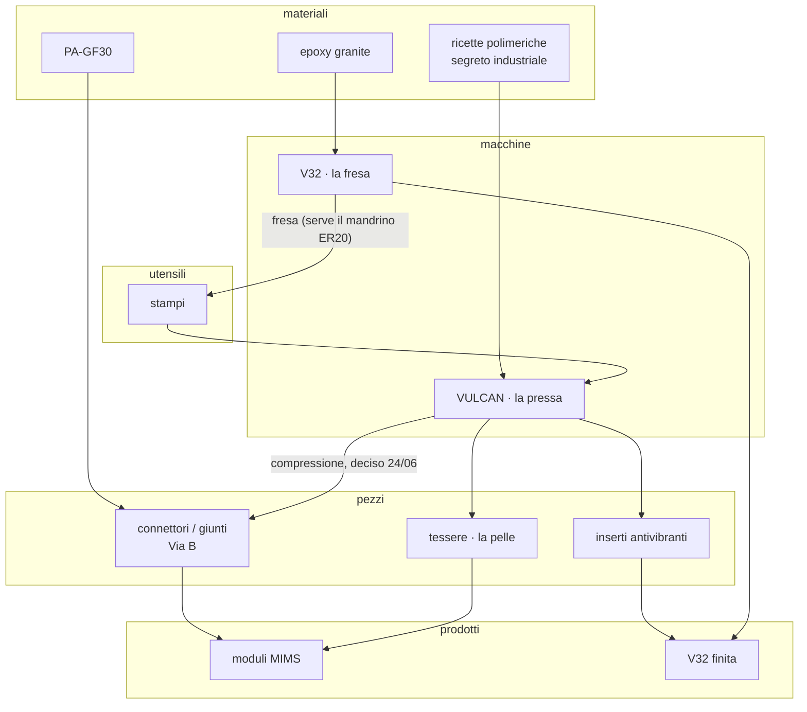

# Analisi #74 — prima di rifare l'unità grafica

*28/09/2026 · sessione #74 · richiesta di Matteo: "è complicato, prima analizzalo".*
*Il perché del ripartire: **MIMS, la fresa (V32) e VULCAN si svilupperanno molto di più**.*
*Solo analisi: nessuna riga di codice cambiata. Numeri misurati sul repo e su MENTE il 28/09.*

---

## 1. In una riga

La dashboard di oggi è costruita attorno al **sistema** (GENESIS). Quella nuova va costruita attorno al
**ferro**, che oggi è la parte meno rappresentata: **VULCAN non ha nessuna vista**, non è nel database
GENESIS e non è un pilastro in `STATE.json`; la distinta materiali di V32 è ferma al **16/03**, l'albero
di MIMS al **31/05**.

---

## 2. Cosa c'è oggi (misurato)

| Cosa | Numero | Nota |
|---|---|---|
| Viste raggiungibili dalla barra | ~40 chiavi, 26 componenti-vista | molte sono varianti della stessa (7 varianti di `StorieView`, 6 di `PitchProgettoView`) |
| Componenti | 46 file, 13.841 righe | più 12 file di dati scritti a mano |
| **Codice morto** | 5 componenti mai importati (~1.977 righe) + 3 file dati (~562 righe) | `DashboardView`, `EcosystemGrid`, `EcosystemLayout`, `EcosystemView`, `MacroCard`; `bussolaTodos`, `criticheAuto`, `criticheData` |
| **Dipendenze mai usate** | 9 | `@react-three/fiber`, `/drei`, `/postprocessing`, `@tsparticles/react`, `/slim`, `react-force-graph-3d`, `@use-gesture/react`, `clsx`, `tailwind-merge` |
| Dipendenze usate solo da codice morto | 2 | `react-force-graph-2d`, `react-grid-layout` |
| Testi minuscoli (6-9 px) | 395 | illeggibili su telefono e in officina |
| Accessibilità | 10 `aria-*`, 5 `role` | quasi zero |
| Colori scritti a mano | 323 (45 diversi) | i token in `index.css` (`@theme`) ci sono ma il codice li scavalca |
| "Neri" di fondo diversi | 6 | `slate-950`, `zinc-950`, `#050a14`, `black`, `#0a0a0f`, `#0f172a` |
| Stili in linea / `!important` | 280 / 19 | |
| Viste che disegnano una mappa | 5 | `MappaView`, `MappaAlberoView`, `AvventuraMapView`, `MappaGiocoView`, `NeuroMapView` |

**Dati scritti a mano e fermi:** `bomData.ts` (45 pezzi di V32: 38 disponibili, 6 mancanti, 1 da integrare)
fermo al 16/03 · `mimsData.ts` al 31/05 · `layersData.ts` al 25/03 · `genesisData.ts` ed `ecosystemTree.ts` all'08/07.

---

## 3. Il ferro: cosa sappiamo e dove sta

| | **V32 — la fresa** | **VULCAN — la pressa** | **MIMS — i moduli** |
|---|---|---|---|
| Stato in `STATE.json` | 65%, "al telaio" | **assente** (non è un pilastro) | 30%, `waiting_press` |
| Nel db GENESIS | `dep_v32` | **assente** | `dep_mims` ("connettori, Via B VULCAN") |
| Vista in dashboard | spiegazione + pitch + distinta (ferma) | **nessuna** | spiegazione + pitch + albero (fermo) |
| Note in MENTE | 7 (specifiche, analisi tecnica, BOM 12/02) | 5 (manifesto, operativo, build reale 22/06) | 36 (disegni dei pezzi, protocollo, bozza brevetto B2) |
| Foto in `FOTO/` | 7 (Config G, 28/05) | **17** (22/06) | 0 |
| CAD | 0 nella sua cartella | — | 4 file `GANCIO_50` (08/2025) |
| Blocco fisico | **mandrino 2,2 kW ER20** da ordinare | **martinetto Vevor 3 stadi** da comprare, non adesso (Matteo 28/09; le note dicevano "da montare") | aspetta la pressa (prima colata del giunto) |

La cartella `FOTO/` ha già la struttura giusta (`V32_BUILD/{bom_seriali,componenti,Config_G,content_hero}`,
`VULCAN_BUILD/`, `MIMS/`, `OFFICINA/`, `PRODOTTI/`) ma è **quasi vuota**: la documentazione del ferro non entra
nel sistema da giugno.

---

## 4. La catena: dove i rami si uniscono

Non è una scelta di design: **è già scritta nelle note di Matteo** (`MENTE/VULCAN/vulcan_e_mims.md`,
"VULCAN ↔ MIMS ↔ V32 — la catena dei materiali"; `BUILD_REALE_20260622.md`; i blocker di `STATE.json`).

I punti d'incontro sono proprio quelli che Matteo chiedeva di legare: **gli stampi** (V32 → VULCAN),
**i connettori e la pelle** (VULCAN → MIMS), **gli inserti** (VULCAN → V32). Sopra tutto, trasversali:
**MENTE/GENESIS** (la memoria), **Nina e le storie** (il racconto), **Identity** (la vetrina).

> **Vincolo:** le proporzioni delle ricette VULCAN sono segreto industriale ("restano in MENTE/VULCAN, mai
> nel repo pubblico"). Il repo è **pubblico**: la nuova dashboard non deve MAI avere dati sensibili scritti
> nel codice. Li legge in locale dall'API (che legge MENTE), e basta.

---

## 5. Cosa serve per seguire la costruzione

Per ognuna delle tre macchine la vista deve rispondere, in quest'ordine:

1. **Cosa blocca adesso** (il pezzo che manca, con il suo costo e dove si compra).
2. **Il prossimo passo fisico** (uno, concreto: "montare il martinetto", "prima colata").
3. **A che punto è**, per fasi, non una percentuale scritta a mano.
4. **La distinta materiali** con lo stato di ogni pezzo (fonte unica, non `bomData.ts` fermo a marzo).
5. **Le decisioni** con data e perché (sono già nelle note: vanno mostrate, non ricopiate).
6. **Le prove e le colate** (un registro).
7. **Le foto e i disegni**, per data, presi dal disco.

E deve essere **facile da alimentare**: una foto in `FOTO/<PROGETTO>/<data>/`, una nota in `MENTE/<PROGETTO>/`,
e la vista si aggiorna da sola. Se per aggiornarla serve toccare il codice, fra un mese è di nuovo ferma.

---

## 6. Decisioni che servono da Matteo (poche, prima del disegno)

1. **VULCAN diventa un pilastro a sé** (in `STATE.json`, nel db GENESIS, in dashboard)? *Consiglio: sì, è metà della catena.*
2. **FIT-PARK** nel db GENESIS: resta o esce? (c'è una critica aperta: "rimuovere dalla roadmap o completare").
3. **Chi guarda la dashboard e dove**: solo tu, al PC? Anche dal telefono, in officina? Anche da fuori, come vetrina?
   *Cambia tutto: in officina servono testi grandi e poche cose.*
4. **Le foto del ferro**: `FOTO/` è quasi vuota. Dove sono le altre (telefono)? Si possono portare lì?
5. **La distinta di V32 del 16/03** è ancora vera (38 disponibili, 6 mancanti)?

### Le risposte di Matteo (28/09)

1. **Sì, VULCAN è un pilastro.** Fatto: `STATE.json` (38% = 3 voci su 8 della Fase 1 del manifesto, con la fonte),
   db GENESIS (`dep_vulcan`), `pct_sync`, barra di stato. La sua stanza arriva col rifacimento.
2. **FIT-PARK esce**: "era un'idea, non una cosa così importante". Tolto dal db, critica chiusa, idea parcheggiata.
3. **Solo dal PC, per ora**; "mi piacerebbe farla vedere in futuro". Quindi: si disegna per lo schermo grande,
   ma come se fosse già pubblica — **nessun dato sensibile nel codice**, le distinte e le ricette si leggono dall'API.
4. **Le foto le organizza Matteo**, in `FOTO/<PROGETTO>_BUILD/<AAAAMMGG>/`.
5. **Le distinte le gestisce Claude**: una per pilastro, fonte unica, in MENTE (privato):
   `MENTE/V32/DISTINTA_V32.md`, `MENTE/VULCAN/DISTINTA_VULCAN.md`, `MENTE/MIMS/DISTINTA_MIMS.md`.
   La V32 del 16/03 **non era più vera** in alcuni punti: le molle sono uscite (corpo unico, maggio), il telaio
   è 60×60, la vite che la dashboard chiamava "1605" nell'inventario del 12/02 è una 2005. I dubbi sono righe
   "da verificare", con le domande in fondo a ogni distinta.

---

## 7. Proposta di struttura (ancora niente estetica)

- **Casa = la catena del ferro**: la mappa a livelli qui sopra, viva, con i blocchi e i prossimi passi sui nodi.
- **Tre stanze del ferro**: V32 · VULCAN · MIMS, stesso schema (sezione 5).
- **Il sistema**: bussola, CRITICHE, automazioni, in una sola vista di controllo.
- **Il racconto**: Nina, storie, pubblicazioni.
- **La vetrina**: CV, pitch.
- **Via**: il codice morto e le 11 dipendenze inutili; le 5 viste-mappa diventano una.

**Metodo (dalla ricerca del 27/09):** plugin ufficiale `frontend-design` per un'identità visiva propria
(niente reference, niente aspetto "generato"); token in Tailwind 4 con un nero solo e una scala tipografica;
**React Flow (`@xyflow/react`) + layout ELK "layered"** per la catena a livelli; dati derivati (db GENESIS +
MENTE + git + FOTO) serviti dall'API locale; `playwright` per verificare le schermate.

## 8. Ordine di lavoro

1. Le decisioni della sezione 6.
2. **Pulizia** (codice morto, dipendenze): nessun cambio visibile, meno peso.
3. **La fonte dati del ferro**: l'API legge MENTE, FOTO, la distinta. Prima i dati, poi il disegno.
4. **Il brief visivo e i token** (`frontend-design`).
5. **La mappa della catena.**
6. **Le tre stanze del ferro.**
7. Il resto della dashboard si riallinea ai token.
